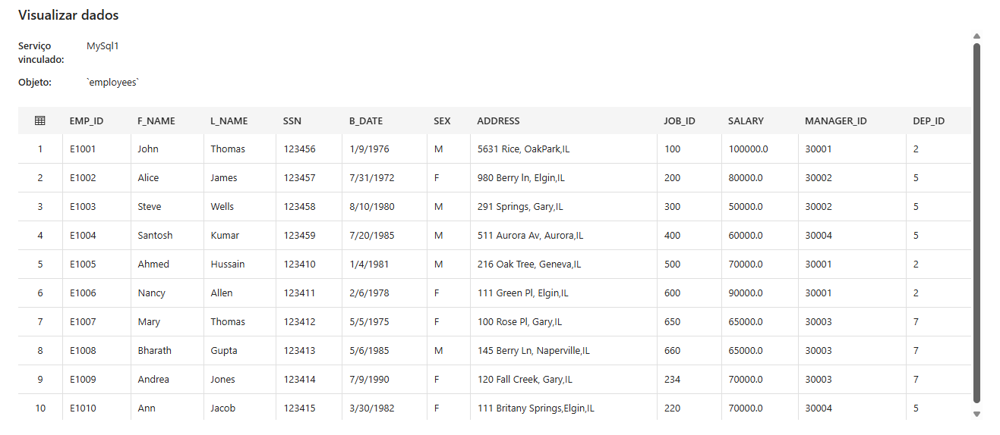

# desafio-dio-pipeline-azure
Este projeto demonstra a construção de um pipeline de engenharia de dados utilizando o Azure Data Factory. A proposta foi integrar uma base de dados MySQL local com o Azure Data Lake Storage Gen2, permitindo a extração e o armazenamento dos dados no formato .csv

# 🔄 Pipeline de Engenharia de Dados com Azure Data Factory

Este projeto faz parte do bootcamp **Microsoft AI for Tech - Azure** promovido pela **DIO.me**. O desafio consistiu em criar um pipeline no **Azure Data Factory** que extrai dados de uma tabela local em **MySQL**, transforma se necessário, e carrega os dados como um arquivo `.csv` no **Azure Data Lake Storage Gen2**.

---

## 🎯 Objetivo do Projeto

Demonstrar a criação de um pipeline de engenharia de dados usando ferramentas da Microsoft Azure, com foco em:
- Conexão com banco de dados local (MySQL)
- Integração com Azure Data Factory
- Armazenamento de dados no Azure Data Lake (Gen2) no formato `.csv`

---

## 🛠️ Tecnologias Utilizadas

- MySQL (local)
- Azure Data Factory
- Azure Storage Account (Gen2)
- Integration Runtime (Self-hosted)
- MySQL Workbench (interface de acesso)
- Azure Portal

---

## 🗂️ Estrutura do Projeto

1. **Banco de Dados Local**
   - Tabela criada no MySQL com dados de teste
   - Exemplo:
     ```sql
     CREATE TABLE employees (
     Emp_id INT PRIMARY KEY,
     F_name VARCHAR(50),
     L_name VARCHAR(50),
     ssn CHAR(6),
     B_date (DATE),
     sex CHAR(1),
     adress VARCHAR(100),
     job_id INT,
     salary DECIMAL(10,2),
     manager_id INT,
     dep_id INT
);
     ```

2. **Azure Data Factory**
   - Criado pipeline com os seguintes componentes:
     - Linked Service para MySQL
     - Linked Service para Azure Blob Storage (Gen2)
     - Dataset de origem (MySQL)
     - Dataset de destino (.csv)
     - Atividade de cópia (Copy Data)

3. **Self-hosted Integration Runtime**
   - Instalado e configurado localmente
   - Autenticado com o Azure Data Factory

---

## 📸 Prints do Projeto

### 🎛️ Azure Data Factory - Pipeline


### 🗃️ Tabela no MySQL


### 📂 Arquivo .CSV no Storage


---

## 💡 Aprendizados e Insights

- A conexão entre banco de dados local e o Azure exige a instalação e configuração do **Integration Runtime**.
- A criação de pipelines no Data Factory é visual e eficiente para processos ETL.
- O armazenamento em Gen2 oferece escalabilidade e integração com outras soluções da Azure.

---

## 🚀 Próximos Passos

- Automatizar esse processo com trigger por tempo.
- Adicionar transformação dos dados (Data Flow).
- Armazenar os dados em formatos otimizados como Parquet ou Delta.

---

## 📎 Referência

- [Documentação oficial do Azure Data Factory](https://learn.microsoft.com/pt-br/azure/data-factory/)

---

## ✅ Status

✅ Desafio Concluído com sucesso.
